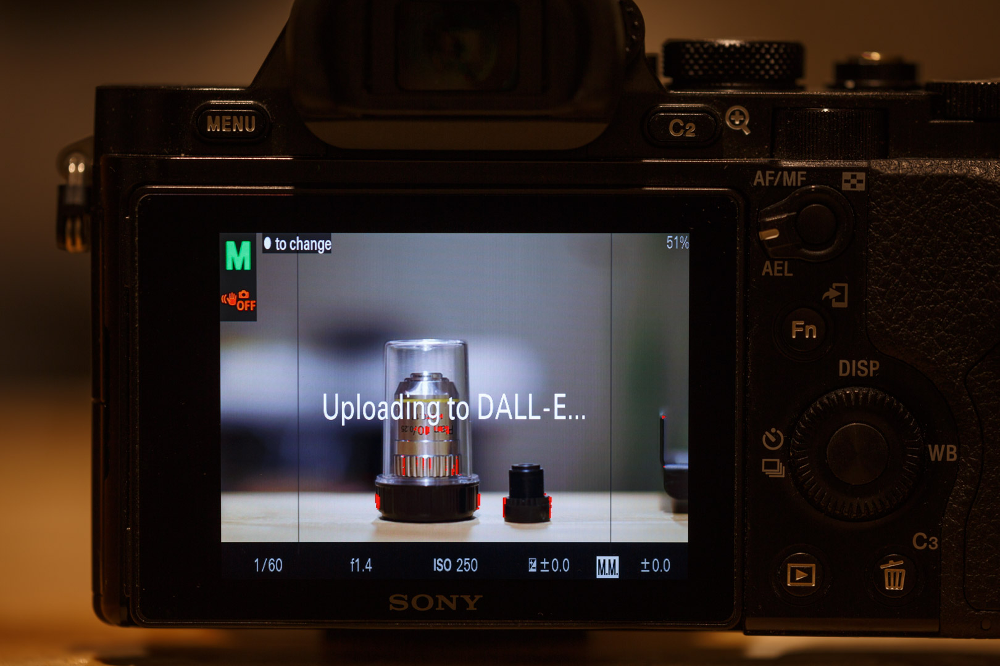

# Quantum Mirror - DALL-E 2 app for Sony cameras 

This app for Android-based Sony cameras (e.g. A7, A7R, A7 II, A7R II, but not the A7 III series or newer) submits
photos to the DALL-E 2 AI, and uses it to generate variants of the photos you take.

See a list of maybe-compatible cameras here (I only tested the app on my A7R and α5000):

https://openmemories.readthedocs.io/devices.html

I am not affiliated with OpenAI or Sony, this is not an official app.

You can see a gallery of sample photos I took here:

https://www.quantum-mirror.com/



## Installation ##

We'll use [Sony-PMCA-RE](https://github.com/ma1co/Sony-PMCA-RE) to install the Quantum Mirror APK into your camera. Note
that PMCA, being reverse-engineered, is somewhat experimental, and in the worst case could brick your camera. No
guarantees!

First connect your camera to your computer using USB and turn it on so that it enters Mass Storage mode, then follow
the steps below for your operating system to install Quantum Mirror:

### Windows

[Download the Quantum Mirror apk](https://github.com/Sherlock-Photography/QuantumMirror/releases/download/1.5.6/QuantumMirror-debug_1.5.6.apk)
and download and run [the pmca-gui app](https://github.com/ma1co/Sony-PMCA-RE/releases/download/v0.18/pmca-gui-v0.18-win.exe).

On the "Install app" tab, click the "select an APK" option, and pick the QuantumMirror-debug_1.5.6.apk file you downloaded,
then click the "install selected app" button.

### macOS

On macOS, first download the `pmca-console` tool by pasting this script into the Terminal app:

```bash
curl -L -o ~/pmca-console https://github.com/ma1co/Sony-PMCA-RE/releases/download/v0.18/pmca-console-v0.18-osx
chmod +x ~/pmca-console
```

Now you can download and install Quantum Mirror like so (enter your login password when prompted):

```bash
curl -L -o QuantumMirror-debug_1.5.6.apk https://github.com/Sherlock-Photography/QuantumMirror/releases/download/1.5.6/QuantumMirror-debug_1.5.6.apk
sudo ~/pmca-console install -f QuantumMirror-debug_1.5.6.apk
```

The installation progress looks like this:

```bash
Native driver not installed
Using drivers libusb-MSC, libusb-MTP, libusb-vendor-specific
Looking for Sony devices

Querying mass storage device
Sony DSC is a camera in mass storage mode

Switching to app install mode
Waiting for camera to switch...
Analyzing apk

Package: com.obsidium.bettermanual
Version: 1.5.6

Starting task
Starting communication
Uploading 0%
Uploading 100%
Downloading 9%
Downloading 21%
Downloading 32%
Downloading 43%
Downloading 54%
Downloading 66%
Downloading 77%
Downloading 88%
Downloading 99%
Downloading 100%
Installing 0%
Installing 100%
Uploading 0%
Uploading 100%
Task completed successfully
```

## Configuration

Your Sony camera can't connect to OpenAI directly (because this Android version only supports TLS 1.0, which is too 
outdated), so you need to deploy a backend to your Amazon AWS account that will serve as a proxy for connecting to 
OpenAI. To create this backend, 
[deploy quantum-mirror-lambda](https://github.com/Sherlock-Photography/quantum-mirror-lambda). After the deploy is
complete, it'll give you an "EndpointForCameraTokenTxt" value to use.

On the OpenAI website, generate a new API key for your account on this page:

https://beta.openai.com/account/api-keys

Now create a text file in the root folder of your camera's SD Card called "AI-SET.TXT", and paste this content into it:

```properties
api-key=sk-xxx
endpoint=https://xxxx.cloudfront.net/
size=1024x1024
count=4
```

On the first line replace the `sk-xxx` with the API key you got from OpenAI.

On the second line, enter your `EndpointForCameraTokenTxt` value.

You can edit the size and count to change how big generated images should be and how many images should be generated in
each batch. Valid sizes are 256x256, 512x512, or 1024x1024 (only). Valid counts are 1-10.

Set up a WiFi connection in your Sony settings (e.g. to a phone WiFi hotspot), since it must be connected at the time
you take your photo for it to be submitted to DALL-E.

## Usage and features ##

You can launch the Quantum Mirror app from the Sony application list.

Photos you take will be saved to the regular Sony playback gallery in RAW and JPEG format, and AI-generated images will 
be saved to the gallery inside the app (you can find them in the DCIM/Camera folder on the SD card).

Use the up/down buttons to cycle between the settings. Rotate the primary control wheel to change the value of the 
selected item.
 
Click on Ael to En/Disable FocusMagnification

Press the Picture/Play Button to open/close the Gallery of AI-generated images. You can navigate through these with the
left and right buttons.

Exit the app using the help/trash button.

### Focus magnification ###

Use the center wheel button to toggle between different zoom factors.

Menu Button adds somekind of Crosshair, the size can get changed with the top left wheel.

Fn button adds a grid to the view

Rotate the center wheel to set focus or use your lens focus

### Troubleshooting ###

If your camera locks up then turn off the power switch, then eject and reinsert the battery to reset the system.

### License information ###

This app is based on the hard work of [obs1dium's BetterManual camera app](https://github.com/obs1dium/BetterManual),
[KillerInk's fork of it](https://github.com/KillerInk/BetterManual), and the reverse-engineered Sony camera app
development kit made by [ma1co](https://github.com/ma1co). See the LICENSE file for the full MIT license information.